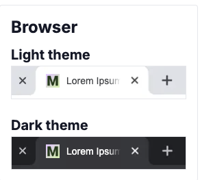
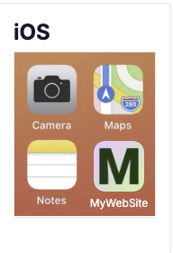
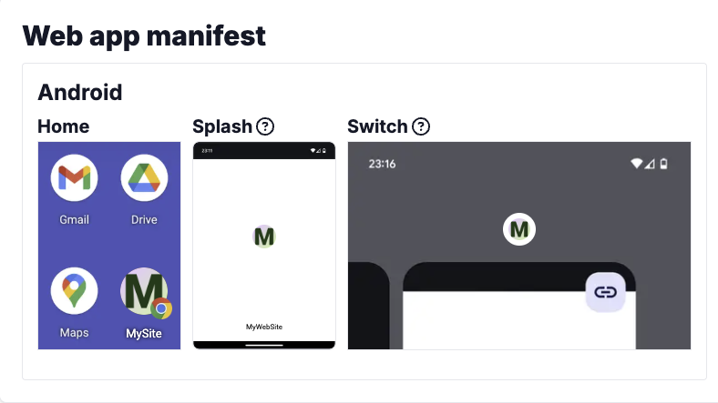
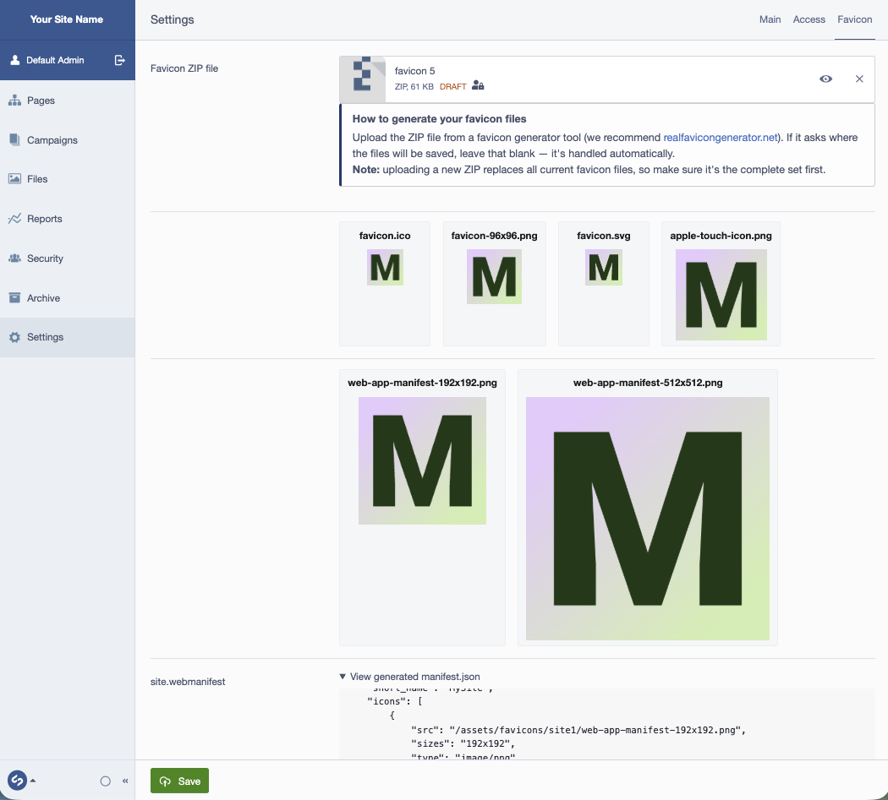

# SilverStripe Favicon Manager

[](https://github.com/normann/silverstripe-favicon-manager/actions/workflows/ci.yml)
[](https://packagist.org/packages/normann/silverstripe-favicon-manager)
[](https://packagist.org/packages/normann/silverstripe-favicon-manager)

Upload the ZIP produced by a favicon generator (such as
[realfavicongenerator.net](https://realfavicongenerator.net/)) once, in **Settings**,
and this module extracts, stores, and versions every favicon and manifest file it
contains — no manual uploads, no hand-editing `manifest.json` paths.

## Requirements

| This module | SilverStripe framework | PHP  |
|-------------|-------------------------|------|
| ^1.0        | ^5.0                    | ^8.1 |

**Optional:** with [`silverstripe/subsites`](https://github.com/silverstripe/silverstripe-subsites)
installed, favicon files are automatically namespaced per-subsite — no config needed.

## Installation

```bash
composer require normann/silverstripe-favicon-manager
vendor/bin/sake dev/build flush=1
```

## Usage

1. Go to **Settings → Favicon** in the CMS.
2. Generate a favicon package at [realfavicongenerator.net](https://realfavicongenerator.net/)
   (leave any "path relative to webroot" field blank).
3. Upload the ZIP via **Favicon ZIP file** and save.

All icon files plus the manifest are extracted, stored under
`/assets/favicons/site<ID>/`, and versioned like any other SilverStripe asset.
Re-uploading a new ZIP always replaces the complete previous set.

## Screenshots

**What visitors see**

| Browser tabs | iOS home screen | Android manifest |
|:---:|:---:|:---:|
|  |  |  |

**What the CMS user sees** — Settings → Favicon, after uploading a ZIP from realfavicongenerator.net:



## Rendering in your template

```html
<% include Favicons %>
```

## Configuration (Optional)

```yaml
SilverStripe\SiteConfig\SiteConfig:
  icons_folder_name: 'my-favicons'
  archives_folder_name: 'zip-archives'
```

## Tests

```bash
vendor/bin/phpunit
```

See [CHANGELOG.md](CHANGELOG.md) for release history — this module follows
[Semantic Versioning](https://semver.org/).

## License

BSD-3-Clause. See [LICENSE](LICENSE).
